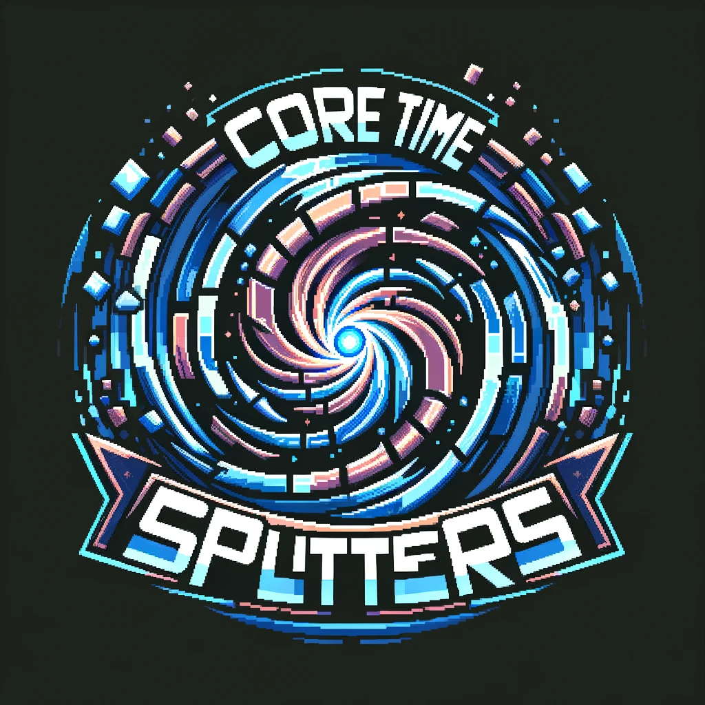
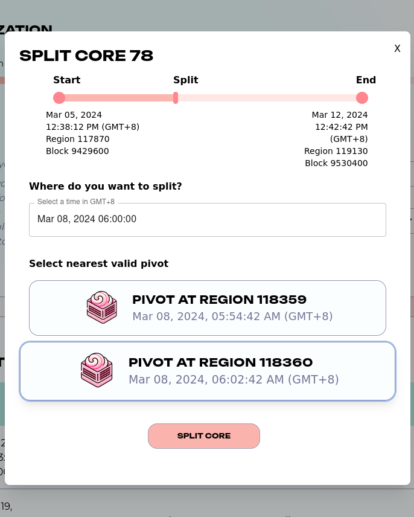
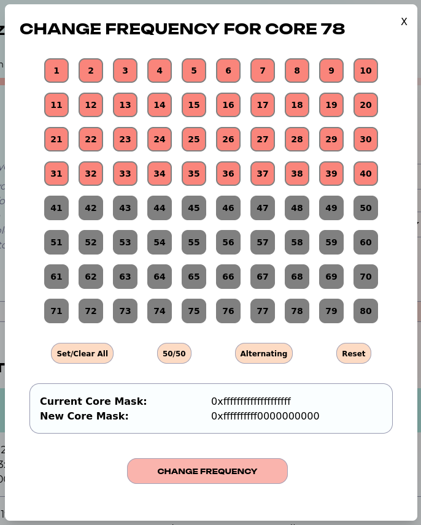

<div align="center">
  <h1 align="center">🔄 CoretimeSplitters</h1>
  <h3>Selling Coretime made easier</h3>
  
</div>

Agile Coretime is set to debut on Polkadot, introducing a new system that optimizes blockspace allocation, enabling users to purchase and manage time-based assets efficiently. This innovation has spurred the creation of secondary marketplaces like Lastic, where users can trade Coretime in a user-friendly environment. Our hackathon project enhances Lastic by adding a feature for the splitting and changing frequency of Coretime NFTs, aiming to boost market efficiency. We're prioritizing user experience and interface design to ensure that dividing Coretime assets is straightforward for all users.

⚙️ Built using [Next.js](https://nextjs.org/), uses pnpm and Tailwind css.

## 🚀 Quick Start

## Getting Started

To set up and run the project, follow the steps below:

```bash
# Install the required dependencies
pnpm install
```

Copy the `.env.local.example` and rename it to `.env.local`. If you are using Subscan create a subscan public token and add it here: NEXT_PUBLIC_SUBSCAN_TOKEN='...'.

Set up the environmental variables, copy and rename `.env.local.example`.

```
# Start the development server
pnpm run dev
```

## Features
We forked the LasticUI repo from Lastic as starting point. We implemented 2 new features to improve the functionality of Lastic in a user-friendly manner. Both features and their inner workings are explained below.

### Splitting coretime
Coretime in Polkadot can be split at the region level. By calling this function, a single Coretime NFT is divided in two Coretime NFT's at a certain point (pivot). For example, a Coretime NFT containing region 1-50 is split at pivot 26. This results in two new Coretime NFT's with these regions:
- Region 1-25
- Region 26-50

### Change frequenc
It's also possible to divide a Coretime NFT by changing the frequency. The frequency is defined as a 80-bit bitmap, which indicates which part of the Coretime can be utilized by the owner of this nft. By changing frequency two new coretime NFT's are created:
- One with the selected frequency
- Another one with the opposite frequency (XOR)

Both these features do not transfer any NFT's. In both cases the original NFT is destroyed, and two new NFT's are minted to the original owner.

In these new features, we focus on providing the best user experience. In the screenshots below it is easy to see how user's are expected to split or change frequency. During the hackathon we got lots of feedback from the Lastic team, which helped us improve the UI a lot!

<p align="center">
  <table>
    <tr>
      <td align="center"><strong>Split</strong></td>
      <td align="center"><strong>Change frequency</strong></td>
    </tr>
    <tr>
      <td></td>
      <td></td>
    </tr>
  </table>
</p>

## Testing instructions

Want to try it out? Follow these steps
1. Go to our deployed dapp [here](https://polkadot-coretime-splitters.vercel.app/).
2. Connect your favorite Polkadot wallet.
3. Buy a core on the [Coretime Sales page](https://polkadot-coretime-splitters.vercel.app/bulkcore1) on our dapp.
4. Navigate to [My Cores page](https://polkadot-coretime-splitters.vercel.app/my-cores) and click on the core you just bough 
5. Scroll down a bit and select either *Change frequency* or *Split*.
6. Decide how to split or change frequency.
7. Click the button and confirm the transaction in your wallet.
8. Go back to the [My Cores page](https://polkadot-coretime-splitters.vercel.app/my-cores) to see the results!

## Next steps

After the hackathon we will continue this project, by intregrating the new features into Lastic. Also we will further research and build additional features that can improve user experience on Lastic.

## Links

- [Video demo]()
- [Presentation slides](https://docs.google.com/presentation/d/1R3a4RzGgCAwP-xCRWhWLP3KRvVsGh-guHrSSnsNFQkk/edit?usp=sharing)
- [Vercel deployment](https://coretime-splitters-ipopifsl3-arjanjohan.vercel.app)

## Team
This project was build during Encode X Polkadot hackathon 2024 by:

- [Noah](https://www.linkedin.com/in/njoeris/)
- [Gunjan](https://www.linkedin.com/in/gunjan321/)
- [arjanjohan](https://x.com/arjanjohan/)
